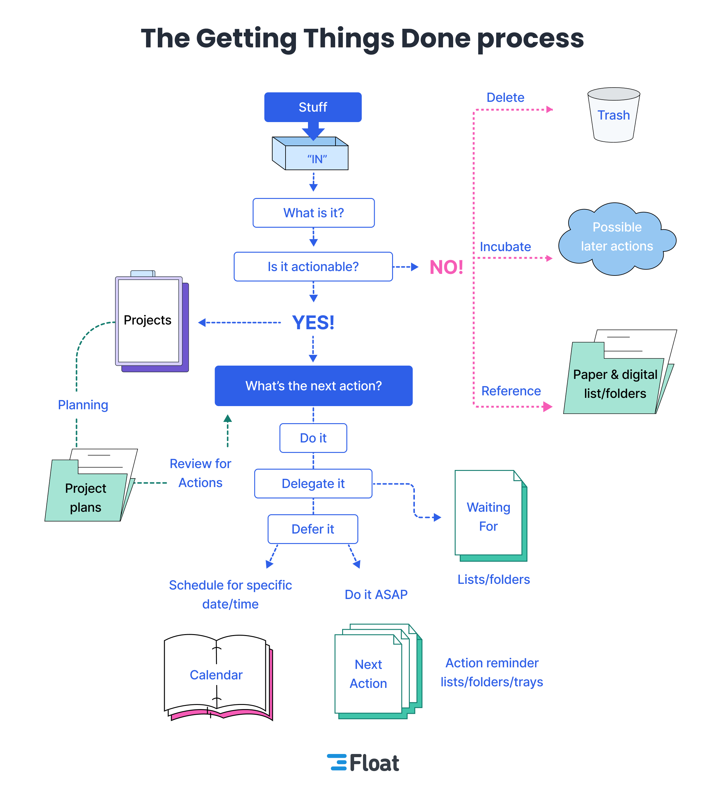

# my GTD Obsidian

> [!IMPORTANT]
> いつでも改造中

## コンセプト

昔EvernoteでやってたGTD環境をこれでやれないかなって。  
基本的にはディレクトリ分けでなんとかできそうな気もするんだけども。  


## 設計思想

このテンプレートは、以下の設計思想に基づいています。

### 情報をネットワーク構造にする
- リンクを使って情報をネットワーク構造で繋ぐ
- Obsidian グラフビュー や Dataview（プラグイン）で、情報の関連性を視覚化および俯瞰する

### 検索による情報アクセス
- Obsidianの検索機能やVSCodeの検索機能を使用して、情報を見つける
- Googleなどの検索エンジンと同じようなアプローチ

### シンプルさの維持
- シンプルなディレクトリ構造
	- ディレクトリ構造による分類は、不整合が発生しやすいので避ける
	- 年単位のディレクトリによるファイリング
	- 日記やノートの新規作成時、自動でファイル配置

### 認知負荷の低減
- 不要な機能（プラグインや設定）をOFF

## 基本的な使い方（ワイの）

### 始業
1. 日記を開く
	1. 適当に今日の予定とかをチェックボックスにして書き出す
2. [[03_projects]] を開く
	1. 更新する
3. [[01_✅Tasks]] と [[02_📝Next Action List]]  を確認する。
4. 頑張る
	1. コーディングしたりエンジニアリング作業に没頭する

### 日中
1. なんかあったら
	1. [[01_inbox]] にメモっておく。チェックボックス付きで。
### 終業
1. 日記を更新する
2. 03_projects を更新する
3. GTD的に、inboxとかnext action とか tasks を整理する。
4. Github に push する。

### 他
[[01_✅Tasks]] ここでチェックをすると、各markdownに完了日時（チェックした日時）が自動で付与されるから、基本的にはここでチェックの操作するとよいよ。仕組みは知らん。

## テンプレートの使い方

> [!WARNING]
> このテンプレートを使用する際は、必ずプライベートリポジトリとして設定してください。個人情報や機密データの保護は利用者の責任となります。公開リポジトリでの使用は推奨されません。

「Use this template」から新規リポジトリを作成した場合は、不要なファイルが含まれているので削除しコミットしてください。

削除対象の不要なファイルおよびディレクトリ：
- README.md
- LICENSE
- 01_diary/2024/2024-09-16.md
- 02_notes/2024/SampleNote.md
- 03_assets/2024/sample/
- 03_assets/2024/sample/sample.drawio
- 03_assets/2024/sample/sample.png
- 03_assets/2024/sample/sample.svg
- 04_canvas/SampleCanvas.canvas

## ディレクトリの用途

- 00_dataview
	- あんまり気にしないでよい。
- 01_inbox
	- GTDのinbox相当
- 03_projects
	- GTDのprojects相当
- 50_資料
	- 資料。01からこっちに行ったり、03の途中でこっちに来たり。
- 99_diary
	- 日記。
- Utility
	- なんかスクリプトとかそういうの。気にしないでよい。

## 運用ルール（参考）

自身の用途に合わせてカスタマイズしてください。

**日々の記録**
- #diary ノートを毎日作成
	- 毎日の出来事、感想
	- その日限りの思考や感情
	- 1つの事柄に対して短い記述（10行以下）
	- 長くなるなら #note に書く
- 99_diary/YYYY 配下にファイルを配置（YYYYは年）
	- めんどいから月別で分けるとかは好きにするよろし

**知識の蓄積**
- #diary から #note へのリンクを記載し、内容を記述
- 1つの事柄、1つのノート
	- 1つのノートには1つの概念、アイデア、事柄のみを書く
- 書くこと：
	- 論題のタイトルに沿った事柄
	- 日付に依存しない情報や考え
	- 抽象的な概念や一般化された知識
	- 一般的、普遍的な内容
- 50_資料/01_notes/YYYY 配下にファイルを配置（YYYYは年）
	- ノートを新規作成した年のディレクトリ配下にファイルが配置される
	- 年ごとのディレクトリ分割により、1ディレクトリあたりのファイル数を抑制
		- 長期的な運用でも安定したファイル管理が可能

**アセットの管理**
- 50_資料/z_素材/assets/YYYY 配下にアセットのグループごとにディレクトリを作成（YYYYは年）
	- 年ディレクトリは手動で作成
- 図の作成：
	- VSCodeでdrawio拡張機能を使用
	- ソースファイルは *.drawio 形式で保存
	- 作成した図は *.png や *.svg などの形式で保存（drawio拡張機能で作成）

**リンクの管理**
- リンクの作成方法：
	- `[[ノート名]]`の形式でリンクを作成する
	- リンクとなるノート名は、文章中に自然に登場できるような名称にする
		- 例：`[[バージョン管理]]には[[Git]]を使用している`
- #diary から #note へのリンク：
	- #diary では簡潔に書き、詳細を #note のリンクを作成し書く
		- 例：`今日は[[git branch コマンド]]について学んだ`
- #note 同士のリンク：
	- 現在のノートの内容と直接関連するノート間でリンクを作成
	- 例：
		```markdown
		# Git branch コマンド

		[[Git]]のブランチ操作に使用するコマンド。主な用途は[[バージョン管理]]における並行開発の実現。[[git merge コマンド]]と組み合わせて使用することが多い。

		## 基本的な使い方
		...
		```
- Map of Contents (MOC)：
	- 必要に応じて特定のトピックに関するMOCを作成可能
	- MOCは一階層のみとし、複雑な階層構造は避ける
	- 例：
		```markdown
		# Git (MOCとなるノート)
		- [[git branch コマンド]]
		- [[git init コマンド]]
		- [[git commit コマンド]]
		```
- リンクの見直し：
	- 定期的にリンクの妥当性を確認し、必要に応じて更新や削除を行う

### #diary と #note の区分基準

1. 時間性：
	- #diary: 今日の出来事、その日限りの思考や感情
	- #note: 日付に依存しない情報や考え
2. 記述量：
	- #diary: 短い記述（10行以下）
	- #note: より長い、詳細な記述
3. 具体性vs抽象性：
	- #diary: 具体的な出来事や行動（例：今日の予定、実際に行ったこと）
	- #note: 抽象的な概念や一般化された知識
4. 個人的vs一般的：
	- #diary: 個人的な経験や感想
	- #note: より一般的、普遍的な内容
5. 再利用性：
	- #diary: 一時的な情報や、その日限りの記録
	- #note: 将来的に参照する可能性が高い情報

例：
- 「今日の朝食はパンだった」→ #diary
- 「効果的な朝食の取り方について」→ #note
- 「明日の会議の準備をした」→ #diary
- 「プロジェクト管理の方法論」→ #note
- 「今日学んだこと：プログラミングの新概念X」→ #diary に簡潔に記述し、詳細は #note にリンクを張って記載

## Obsidian 設定
- 適当。頻繁に変えてるからわからん。
- けっきょく最後は配色とかテーマにいくんじゃない？
- 機能とかほとんど変わらんしそうなったらもう色よ色w